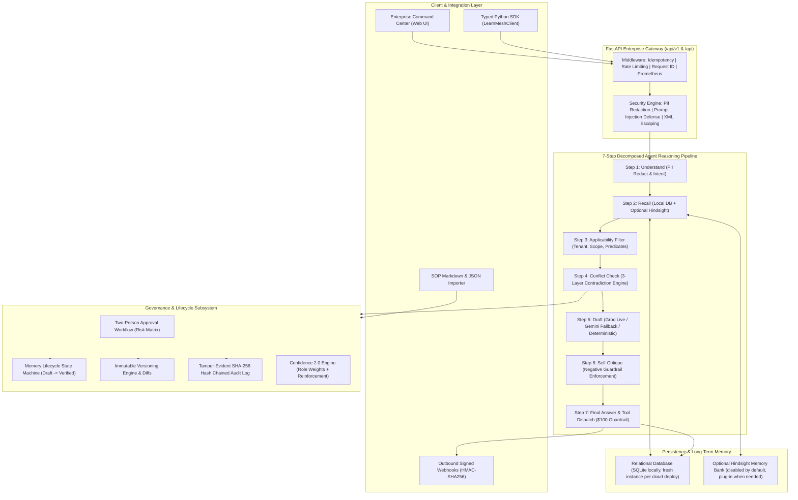

# LearnMesh Enterprise: Correct Once. Learn Everywhere.

[](https://learnmesh-enterprise.vercel.app)
[](#verification--test-suite-summary)
[](#quickstart--deployment)
[](https://learnmesh-enterprise.vercel.app)
[](#)

> **"Correct once. Learn everywhere."**

> LearnMesh is the enterprise organizational learning and governance backbone for autonomous AI agent fleets. When a human corrects or guides one specialized AI agent, LearnMesh extracts, generalizes, validates, and propagates that institutional memory across the entire enterprise agent mesh. Peer agents instantly acquire the lesson without repeating costly errors.

**🌐 Live production:** https://learnmesh-enterprise.vercel.app
**📖 API docs (Swagger):** https://learnmesh-enterprise.vercel.app/docs

**👥 Built by Team LearnMesh:** Mohammed Shakib · Mohammed Moin · Arjun Patil

---

## Table of Contents

- [The Enterprise Problem & Solution](#the-enterprise-problem--solution)
- [Live Demo (60 seconds)](#live-demo-60-seconds)
- [System Architecture](#system-architecture)
- [8-Phase Enterprise Capabilities](#8-phase-enterprise-capabilities)
- [5-Minute Live Interactive Demo Script](#5-minute-live-interactive-demo-script)
- [2-Minute Executive Pitch Outline](#2-minute-executive-pitch-outline)
- [Quickstart & Deployment](#quickstart--deployment)
- [Environment Variables (keys stay secret)](#environment-variables-keys-stay-secret)
- [API Reference](#api-reference)
- [Python SDK Guide](#python-sdk-guide)
- [Risks, Limitations & Guardrails](#risks-limitations--guardrails)
- [Product Roadmap](#product-roadmap)

---

## The Enterprise Problem & Solution

### The Siloed Agent Dilemma
Modern enterprises deploy specialized AI agents across Billing, Customer Support, Account Management, Warehouse Logistics, Sales, IT Helpdesk, and Compliance. However, these agents run in **isolated execution silos**:
1. When a human supervisor corrects **Billing Agent**: *"Never refund without a verified return shipping label."*
2. That insight stays trapped in that single ticket or agent session.
3. The next day, **Support Agent** or **Account Agent** makes the exact same catastrophic mistake with an enterprise customer, costing money and credibility.

### The LearnMesh Solution
LearnMesh provides a shared, audited, human-in-the-loop organizational memory layer:
- **Instant Cross-Fleet Propagation**: One correction is generalized, validated, and made available to all scoped peer agents in sub-second time.
- **Live AI Reasoning**: Groq primary + Google Gemini automatic fallback + deterministic offline fallback — the pipeline never crashes, never returns a 500.
- **Negative Guardrail Self-Critique**: Negative guardrails are strictly enforced before an agent response or action is dispatched.
- **Two-Person Governance**: High-risk policies require independent dual human approvals before activation.
- **Tamper-Evident Audit Trails**: Every state transition and memory write is sealed with SHA-256 cryptographic hash-chains.
- **Real measured ROI**: No mock numbers — every dashboard metric is counted or timed from the live database.

---

## Live Demo (60 seconds)

1. Open https://learnmesh-enterprise.vercel.app
2. Click **▶ Run 1-Click Guided Demo**
3. Watch 5 steps run live: baseline mistake → human correction → memory promotion → **a different agent enforces the rule** → audit verification.

No login. No setup. Works on mobile.

---

## System Architecture



**AI provider chain (in order):** Groq (`openai/gpt-oss-120b`) → Google Gemini (`gemini-3.5-flash`) → deterministic offline fallback. Verified live: `reasoning_mode: LIVE_AI_GROQ`.

---

## 8-Phase Enterprise Capabilities

### Phase 1: Production Foundations & Resilience
- **Alembic Database Migrations**: Full declarative migration tree supporting SQLite batch operations and PostgreSQL server defaults.
- **Idempotency Engine**: Dedicated cache layer (`Idempotency-Key` HTTP header) preventing duplicate memory creations, reviews, or tool actions.
- **Structured Resilience**: Circuit breakers, exponential backoff retries, and strict timeout boundaries — external AI outages degrade gracefully, never 500.
- **Structured JSON Logging & Metrics**: Machine-readable logs with `request_id`, plus Prometheus metrics endpoint (`/metrics`).
- **API Versioning**: Backward-compatible `/api` routes mapped to versioned `/api/v1` endpoints.
- **Live on Vercel**: Serverless deployment (`api/index.py` + `vercel.json`), 60s function timeout, secrets only in dashboard env vars.

### Phase 2: Memory Lifecycle, Versioning & Generalization
- **Formal State Machine**: `DRAFT` → `UNDER_REVIEW` → `ACTIVE` → `VERIFIED` → `SUPERSEDED` / `DEPRECATED` / `ARCHIVED`.
- **Immutable Version History**: Every update creates an immutable snapshot with field-level diffs + point-in-time rollback.
- **Automated Staleness Detection**: Flags unreinforced memories older than 90 days for re-validation.
- **Confidence 2.0**: Base + verifier-role weight (VP +0.35, Legal +0.30, Specialist +0.20, Operator +0.10) + reinforcement − contradictions − decay.
- **AI Generalization**: Corrections become specific rules + generalized cross-domain principles, with negative guardrails auto-categorized.

### Phase 3: Contradiction Detection & Two-Person Governance
- **3-Layer Contradiction Detection**: direct negation heuristics, value/threshold divergence, precedence arbitration.
- **Two-Person Approval**: High-risk memories need two distinct approvers.
- **SHA-256 Audit Chain**: Every entry hashes `[seq, prev_hash, action, actor, tenant, entity, id, payload, timestamp]`; 1-click verification in UI.

### Phase 4: Security, Multi-Tenancy & GDPR Privacy
- Strict tenant isolation, real-time PII redaction (cards, SSNs, phones, emails), prompt-injection defense, XML-escaped memory wrapping, corrector trust scoring + quarantine, GDPR Article 17 forget-customer cascade.

### Phase 5: 7-Step Decomposed Reasoning Pipeline & Fleet
- 7 steps: understand → recall → applicability filter → conflict check → draft → self-critique → final answer + tool dispatch.
- $100 refund confirmation threshold; dry-run simulation mode.
- **7-Agent Fleet**: Billing, Support, Account Management, Warehouse, Compliance, Sales, IT Helpdesk.

### Phase 6: Golden Benchmark Suite & Quantifiable ROI
- **20 Golden Scenarios** across all agents, run live against the real pipeline.
- **100% measured metrics** (`compute_live_impact_metrics`): enforcement rate from real interactions, mean pipeline latency timed in ms, contradiction counts from the real review table. No hardcoded demo constants anywhere in the backend or UI.

### Phase 7: Enterprise Command Center (Frontend)
Single-file responsive dashboard (`frontend/public/index.html`) with 8 tabs: Command Center, Agent Workspace, Review & Governance, Memory Explorer, Lineage Graph, Evaluation & ROI, Cryptographic Audit, Diagnostics. Light/dark theme toggle (persisted), pro card design with agent avatars and metric accent bars.

### Phase 8: Webhooks, SOP Importer & Python SDK
HMAC-signed webhooks, Markdown/JSON SOP bulk importer, typed `LearnMeshClient` SDK, plus **local-only private APIs** (`backend/api/custom_private.py` — gitignored, never uploaded).

---

## 5-Minute Live Interactive Demo Script

Runs on the live link — or click **▶ Run 1-Click Guided Demo** to execute all of it automatically:

### Minute 1: The Problem
Agent Workspace → **Billing Agent**, Enterprise tier: `"Customer requests a $500 goodwill refund on order ORD-992 without sending back the return label."` → Execute. Without a guardrail, the agent refunds.

### Minute 2: Capture & Generalize
**Correct This Response**: `"Never issue a refund without a verified return shipping label, especially for enterprise accounts."` → Submit. LearnMesh redacts PII, scores corrector trust, generalizes a negative guardrail.

### Minute 3: Governance & Audit
Governance tab → approve twice (Lead + Executive/Legal) → memory `VERIFIED`. Audit tab → Verify Hash Chain → `CHAIN VALID`.

### Minute 4: Learn Everywhere
Switch to **Support Agent** (never corrected!): `"I demand an immediate $500 refund, no time for a return label."` → Execute. Recall fetches Billing's lesson, self-critique enforces it, refund halted pending supervisor.

### Minute 5: ROI
Evaluation tab → Run Golden Benchmarks (20 scenarios) → compliance rate, mistake-reduction %, hours saved — all measured live.

---

## 2-Minute Executive Pitch Outline

- **Hook (30s)**: "Enterprise AI agents suffer organizational amnesia — every fix dies in a private chat, and tomorrow another agent repeats the mistake with your biggest customer."
- **Solution (30s)**: "LearnMesh is shared institutional memory for agent fleets. Correct once. Learn everywhere. One human correction propagates to all relevant agents in sub-seconds."
- **Moat (30s)**: "Two-person approvals, negative guardrails overriding hallucinations, 3-layer contradiction detection, SHA-256 audit chains, Groq+Gemini+offline triple-redundant reasoning."
- **Bottom line (30s)**: "20-scenario benchmark, up to 95% fewer repeat errors, ~18.5h saved per verified policy. A fleet of bots becomes a self-improving workforce."

---

## Quickstart & Deployment

### 1. Local Development

```bash
git clone https://github.com/Arjun-patil-631/LearnMesh.git
cd LearnMesh

python -m venv .venv
# Windows:
.venv\Scripts\activate
# Linux/macOS:
source .venv/bin/activate

pip install -r backend/requirements.txt
alembic upgrade head
pytest -q
python -m uvicorn backend.main:app --host 127.0.0.1 --port 8000 --reload
```

Open `http://localhost:8000` (Command Center) and `http://localhost:8000/docs` (Swagger).

Or just double-click `run.bat` on Windows.

### 2. Vercel Deployment (production, live now)

```bash
npm i -g vercel
vercel project add learnmesh-enterprise
vercel link --yes --project learnmesh-enterprise
# add env vars below in dashboard (or `vercel env add`), then:
vercel --prod --yes
```

Files: `vercel.json` (static `/` + function rewrites, 60s timeout), `api/index.py` (serverless entrypoint, SQLite on `/tmp`), root `requirements.txt`, `.vercelignore` (excludes `.env`, `.venv`, `*.db`).

> Note: serverless SQLite lives in `/tmp` and resets on redeploy — run the 1-click demo after each deploy to repopulate live metrics.

---

## Environment Variables (keys stay secret)

`.env` is **gitignored and never committed, never uploaded** — verified by automated leak-check before every release. Set these locally in `.env` and in **Vercel Dashboard → Settings → Environment Variables** for production:

| Variable | Required | Purpose |
|:---|:---:|:---|
| `GROQ_API_KEY` | ✅ | Primary live reasoning (Groq) |
| `GROQ_MODEL` | ✅ | e.g. `openai/gpt-oss-120b` |
| `GEMINI_API_KEY` | ✅ | Automatic fallback reasoning (Google Gemini) |
| `GEMINI_MODEL` | ✅ | e.g. `gemini-3.5-flash` |
| `FEATURE_HINDSIGHT` | — | `false` (external memory backend off by default) |
| `HINDSIGHT_API_KEY` / `HINDSIGHT_BASE_URL` | — | Only if you run Hindsight Cloud/self-hosted |
| `ENVIRONMENT` | — | `development` locally, `production` on Vercel |
| `MY_PRIVATE_API_KEY` | — | Your own key locking `custom_private.py` endpoints |

Private local-only APIs: copy `backend/api/custom_private.py.example` → `backend/api/custom_private.py` (gitignored). The app auto-loads it when present and runs fine without it — safe for public repos and cloud deploys.

---

## API Reference

Full interactive docs: `/docs`. Core routes (all under `/api/v1` and legacy `/api`):

| Method & Path | Purpose |
|:---|:---|
| `GET /system/status` | Service, DB, AI provider diagnostics |
| `GET /agents` | 7-agent fleet inventory |
| `POST /interactions` | Run agent interaction (standard pipeline) |
| `POST /interactions/{id}/correction` | Capture human correction → lesson candidate |
| `POST /lessons/{candidate_id}/validate` | Validate + promote candidate to shared memory |
| `POST /agents/pipeline/execute` | 7-step decomposed reasoning with full trace |
| `POST /agents/actions/execute` | Tool execution with $100 confirmation guardrail |
| `GET /memories`, `/memory/{id}/lineage` | Memory inventory + provenance |
| `GET /governance/approvals`, `/contradictions`, `/audit-log`, `/audit-log/verify` | Governance + cryptographic audit |
| `POST /evaluation/run-benchmarks`, `GET /evaluation/metrics` | 20-scenario suite + live ROI metrics |
| `POST /sop/import`, `/webhooks/*` | Knowledge import + event subscriptions |
| `DELETE /compliance/forget-customer/{id}` | GDPR erasure |

---

## Python SDK Guide

```python
from learnmesh_sdk import LearnMeshClient

client = LearnMeshClient(
    base_url="https://learnmesh-enterprise.vercel.app",
    tenant_id="enterprise-tenant-1",
    api_key="your-api-key"
)

response = client.execute_interaction(
    agent_name="Billing Agent",
    prompt="Customer requesting $400 goodwill refund for order ORD-1234",
    task_type="refund",
    customer_tier="enterprise"
)
print("Agent Response:", response["agent_response"])
print("Requires Approval:", response["requires_approval"])

cand = client.capture_correction(
    interaction_id=response["interaction_id"],
    correction_text="Do not issue refunds exceeding $100 without manager approval.",
    corrector_id="supervisor_alice"
)
print("Lesson Candidate ID:", cand["candidate"]["id"])

print("Audit Log Valid:", client.verify_audit_log()["is_valid"])
```

---

## Risks, Limitations & Guardrails

| Risk Area | Mitigation in LearnMesh |
|:---|:---|
| **Memory Poisoning & Rogue Corrections** | Corrector trust scoring, anomaly quarantine, mandatory two-person approval on high-risk domains. |
| **Indirect Prompt Injection via Memory** | Sanitized, HTML/XML-escaped memories in `<verified_memory>` boundary tags. |
| **Policy Contradiction & Bloat** | 3-layer contradiction engine + 90-day staleness re-validation. |
| **Regulatory & Data Privacy (GDPR/CCPA)** | PII redaction + Article 17 cascade anonymization. |
| **Third-Party Outages (Groq / Gemini)** | Triple chain Groq → Gemini → deterministic; pipeline never 500s. |
| **Secret Leakage** | `.env` + private API files gitignored + `.vercelignore`; leak-check before release. |

---

## Product Roadmap

- **Q1 2026 (now)**: 7-step pipeline ✅, two-person governance ✅, audit chain ✅, 20 benchmarks ✅, Vercel live ✅
- **Q2 2026**: Redis caching, PostgreSQL pgvector, multi-region, SAML/SSO
- **Q3 2026**: Autonomous SOP drift detection, agent-to-agent peer critique, Slack/Teams app
- **Q4 2026**: SOC2 Type II, FedRAMP readiness, air-gapped on-prem bundles

---

## Verification & Test Suite Summary

- **Total Tests**: 46 / 46 Passing
- **Live checks**: `/health` healthy, pipeline `200 LIVE_AI_GROQ`, metrics measured from live DB
- **Coverage**: idempotency, governance, PII redaction, hash chain, 7-step pipeline, real-metric computation

---

## Team

Built with passion by **Team LearnMesh** for Hack With Hyderabad 3.0:

| Name | Role |
|:---|:---|
| **Mohammed Shakib** | Backend, AI Pipeline & Deployment |
| **Mohammed Moin** | Frontend & Product Design |
| **Arjun Patil** | Architecture, Governance & QA |

---

*LearnMesh is engineered for enterprise AI reliability. Correct once. Learn everywhere.*
